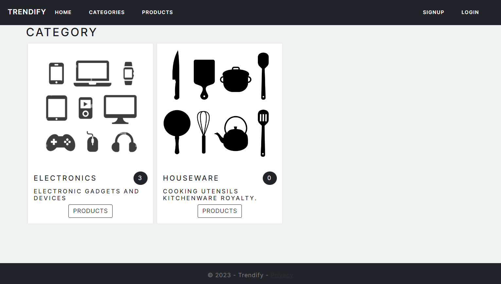
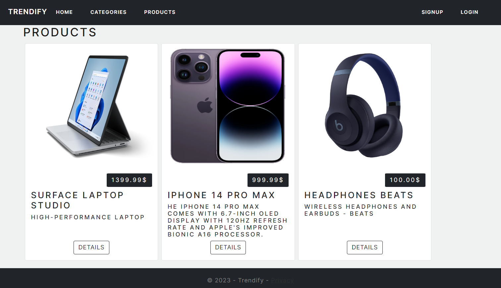
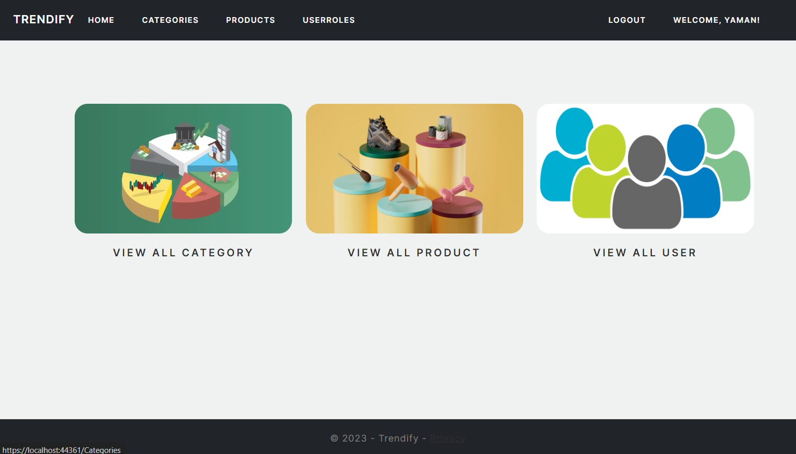
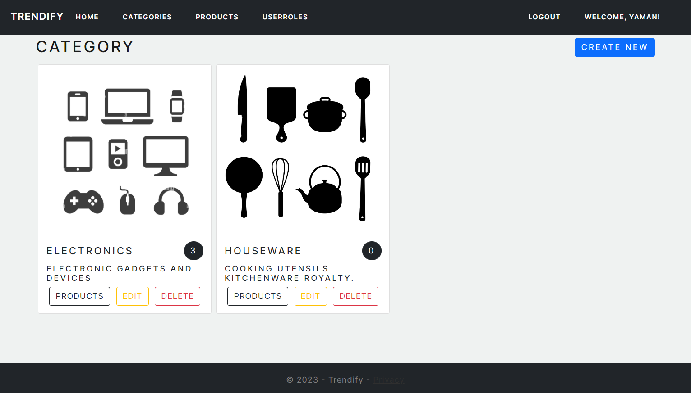
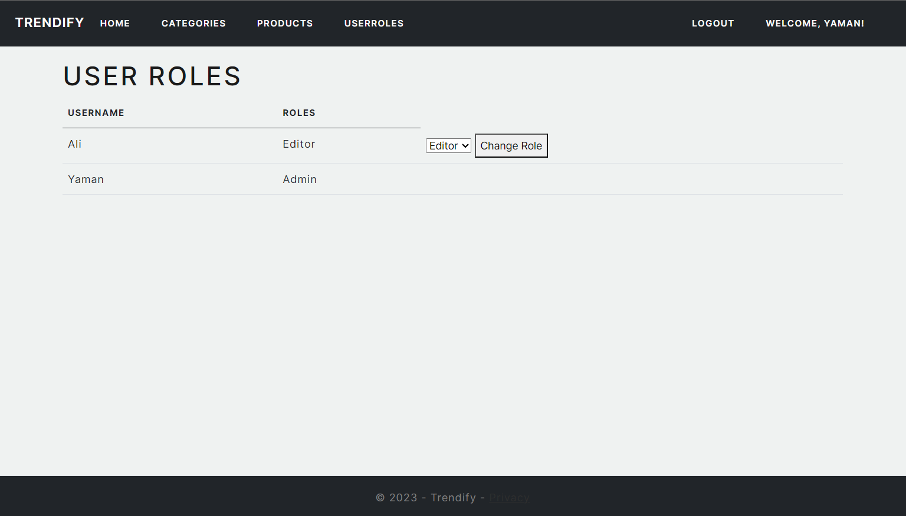
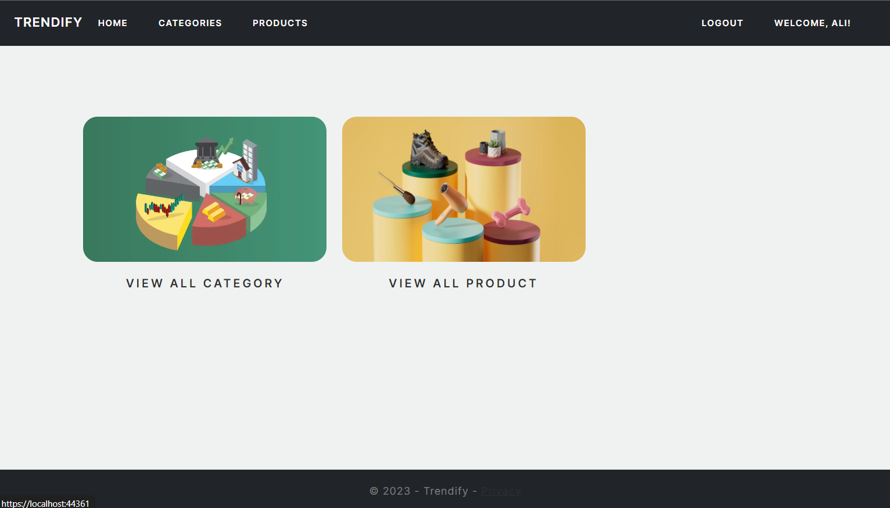
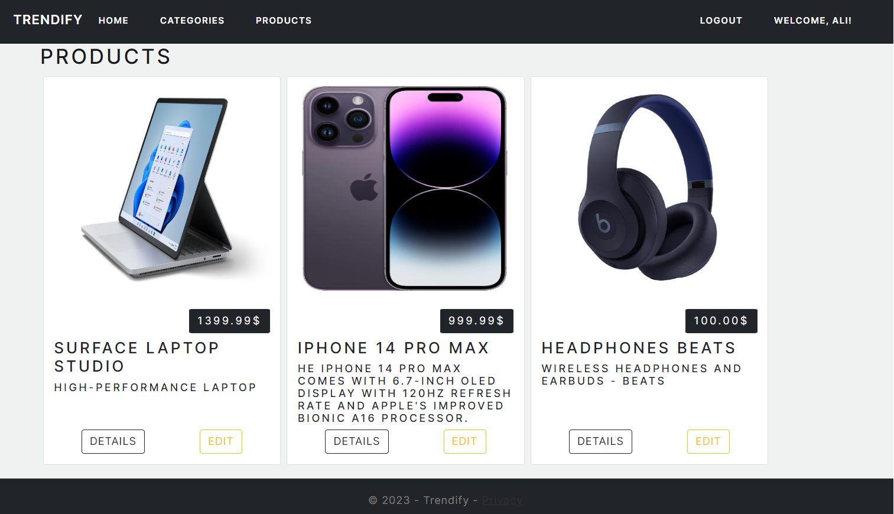
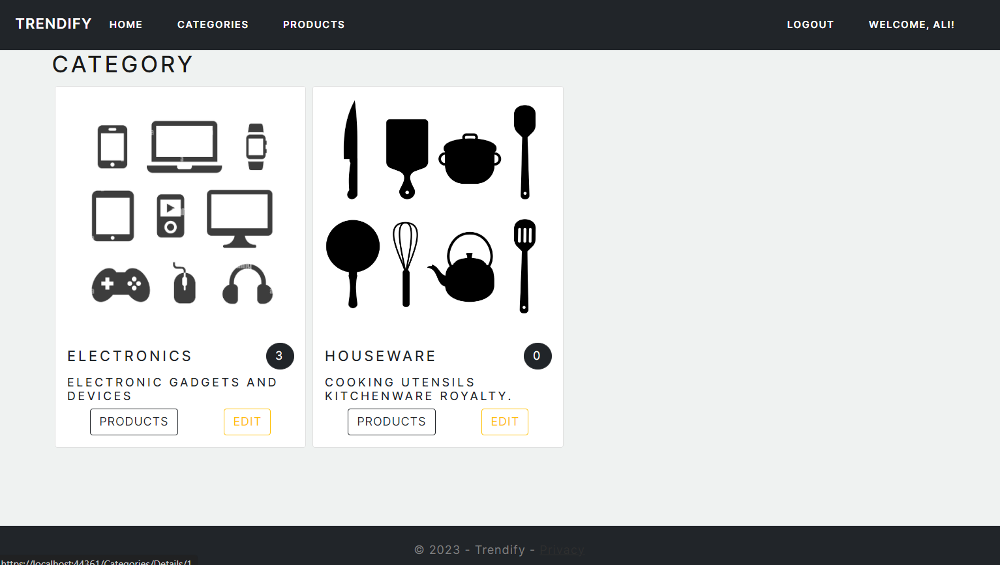

# Trendify

Welcome to Trendify, your one-stop destination for online shopping. Trendify is an e-commerce web application designed to provide a seamless shopping experience for customers. With a wide range of products and user-friendly features, Trendify makes shopping enjoyable and convenient.

live Demo : [https://trendify20230916221637.azurewebsites.net/](https://trendify20231001174654.azurewebsites.net)

# Table of Contents 

1. [Introduction](#INTRO)
2. [User Stories](#USER)
3. [Entity Relationship Diagram](#ERD)
4. [Website Preview](#PREVIEW)

# Introduction 

An Trendify E-Commerce web application for an electronics store and accessories for these products.

Trendify web application contains Admin Dashboard for Adding, Editing & Deleting categories or
products and Admin can view all users role and can change ``Editor`` to ``Admin``.

# User Stories:

### Admin:
1. Easily manage categories, including creating, editing, and deleting them.
2. Effortlessly handle products, with the ability to create, edit, and remove them.
3. Seamlessly oversee the entire product inventory.
4. Access a detailed record of all user purchases.

### Editor:

1. Can see the details of categories and products.
2. Can edit the products and categories.
3. Associating products with their relevant categories.

### User:

1. User can access to all categories for convenient navigation.
2. user can detailed product information, including name ,price, and the Description of the product.
3. User can SignIn/SignOut of the website.

# Website Preview 

1. User Categories Page:

2. User Products Page:

3. Admin Page:

4. Admin Categories Page:

5. User Roles Page:

6. Editor Page:

7. Editor Product Page:

8. Editor Categories Page:

## Key Features

- Browse and explore a diverse collection of products.
- View detailed product descriptions, prices, and availability.
- Add products to your cart for easy checkout.
- Trendify offers a rich variety of products, organized into different categories. The `Category` model is at the heart of this organization, allowing products to be grouped logically for easy navigation. Each category has a unique identifier, a name, and a description that helps users understand its contents.
- Place orders and track delivery status.
- Enjoy secure and convenient online payments.

## Getting Started

To get started with Trendify, follow these steps:

1. Clone this repository to your local machine.
2. Set up the required dependencies and configurations (instructions below).
3. Launch the application and start exploring the products.
4. Add products to your cart, place orders, and enjoy shopping!

# Entity Relationship Diagram 

