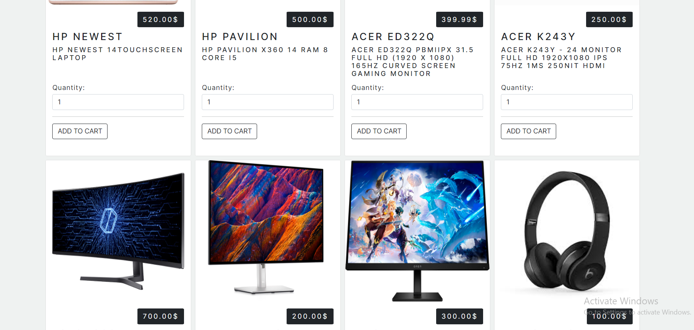

# Trendify

Welcome to Trendify, your one-stop destination for online shopping. Trendify is an e-commerce web application designed to provide a seamless shopping experience for customers. With a wide range of products and user-friendly features, Trendify makes shopping enjoyable and convenient.

## ***important note***
* There may be some problems when using the ``Chrome browser``
* It is better to use the ``Edge browser``.
* live Demo : [https://trendify20230916221637.azurewebsites.net/](https://trendify20231001174654.azurewebsites.net)

# Table of Contents 

1. [Introduction](#INTRO)
2. [User Stories](#USER)
3. [Entity Relationship Diagram](#ERD)
4. [Website Preview](#PREVIEW)

# Introduction 

An Trendify E-Commerce web application for an electronics store and accessories for these products.

Trendify web application contains Admin Dashboard for Adding, Editing & Deleting categories or
products and Admin can view all users role and can change ``Editor`` to ``Admin``.

# User Stories:

### Admin:
1. Easily manage categories, including creating, editing, and deleting them.
2. Effortlessly handle products, with the ability to create, edit, and remove them.
3. Seamlessly oversee the entire product inventory.
4. Access a detailed record of all user purchases.
5. Admin can see the orders: The admin can access and view the orders placed by users.
6. Admin can add, remove, and modify products: Admin has control over the product catalog, allowing them to manage the inventory.
7. Admin can add a new user or modify users: Admin can manage user accounts and roles.
8. Admin has his own page: Admin has a dedicated dashboard or section for managing the website.

### Editor:

1. Can see the details of categories and products.
2. Can edit the products and categories.
3. Associating products with their relevant categories.

### User:

1. User can access to all categories for convenient navigation.
2. user can detailed product information, including name ,price, and the Description of the product.
3. User can SignIn/SignOut of the website.
4. User can add products to the cart: Users can select products and add them to their shopping cart for later purchase.
5. User can purchase products: Users can complete the purchase process for the items in their cart.

# Website Preview 

1. User Home Page:

2. User Categories Page:

3. User Products Page:

4. Admin Dashboard:

5. Admin Order Page:

6. User Cart Page:

## Key Features

- Browse and explore a diverse collection of products.
- View detailed product descriptions, prices, and availability.
- Add products to your cart for easy checkout.
- Trendify offers a rich variety of products, organized into different categories. The `Category` model is at the heart of this organization, allowing products to be grouped logically for easy navigation. Each category has a unique identifier, a name, and a description that helps users understand its contents.
- Place orders and track delivery status.
- Enjoy secure and convenient online payments.

## Getting Started

To get started with Trendify, follow these steps:

1. Clone this repository to your local machine.
2. Set up the required dependencies and configurations (instructions below).
3. Launch the application and start exploring the products.
4. Add products to your cart, place orders, and enjoy shopping!

# Entity Relationship Diagram 

